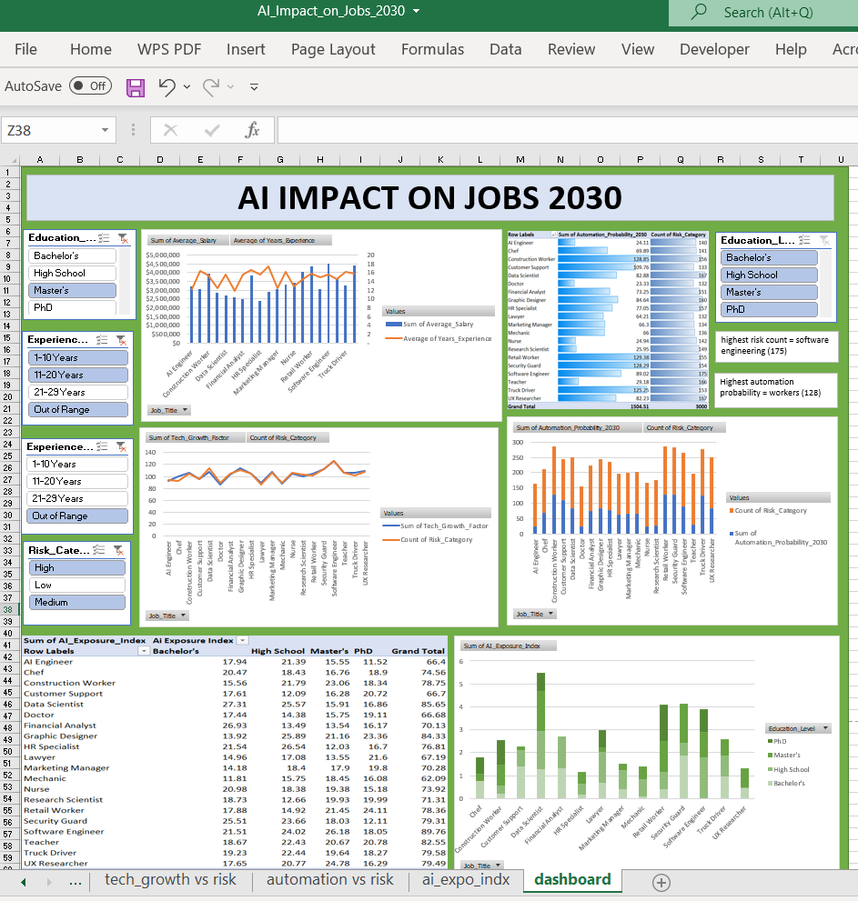

# AI Job Impact

## Overview

This project presents a comprehensive analysis of the potential impact of artificial intelligence on employment and job market dynamics through 2030. The analysis includes data-driven insights, industry trends, and projections to help stakeholders understand the evolving landscape of AI-driven workforce transformation.

## Key Features

- **Comprehensive Data Analysis**: In-depth examination of AI's impact across multiple job sectors
- **Interactive Dashboard**: Visual representation of key metrics and trends
- **2030 Projections**: Forward-looking analysis with quantified impact assessments
- **Methodology Documentation**: Transparent approach to data collection and analysis

## Contents

- `dashboard.ipynb` - Interactive Jupyter notebook with detailed analysis and visualizations
- `images/` - Supporting visualizations and dashboard screenshots
- `data/` - Source datasets and analytical results

## Methodology

This analysis combines multiple data sources including:
- Labor market statistics and employment trends
- AI adoption rates across industries
- Occupational impact assessments
- Historical precedent from previous technological transitions

## Key Findings

Further detailed insights, sector-specific analysis, and actionable recommendations will be documented in the supporting notebooks and documentation.

## How to Use

1. Open the Jupyter notebooks to explore the interactive analysis
2. Review the dashboard for high-level insights
3. Consult the detailed reports for sector-specific impacts

## Data Sources

- [Provide specific data source references here]
- [Add additional sources as applicable]

## Contributing

Contributions and feedback are welcome. Please feel free to submit issues or pull requests to improve this analysis.

## License

[Specify your license here, e.g., MIT, Apache 2.0, etc.]

## Contact

For questions or inquiries about this analysis, please reach out through the repository.

---

*Last updated: April 2, 2026*
